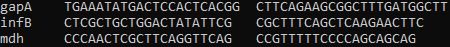

É possível simular uma PCR de forma computacional e existem vários programas que podem ser utilizados para esse propósito. Aqui falaremos do seqkit e do emboss.

**Como encontrar o amplicon?**

O amplicon é o trecho de DNA que se encontra entre os primers forward e reverse. Esse é o fragmento que é amplificado em uma reação de PCR.

Para encontrar o amplicon in silico, basta fornecer ao programa o par de primers e o genoma a ser buscado. Vamos utilizar como exemplo os primers do gene *wzi* da *K. pneumoniae*:

- Forward: GTGCCGCGAGCGCTTTCTATCTTGGTATTCC

- Reverse: GAGAGCCACTGGTTCCAGAAYTTSACCGC

O comando no seqkit é:
```{bash}
#| eval: false
seqkit amplicon -F GTGCCGCGAGCGCTTTCTATCTTGGTATTCC -R GAGAGCCACTGGTTCCAGAAYTTSACCGC GCF_000240185.1_ASM24018v2_genomic.fna
```
Onde -F indica o primer forward, -R indica o primer reverse, e o arquivo GCF.fna contém o genoma da *K. pneumoniae*.

A sequência resultante aparecerá diretamente no terminal, a menos que seja direcionada para um documento específico: 


Já no emboss, não é possível passar os primers pela linha de comando, é preciso adicioná-los a um documento e este sim pode ser passado no comando. Além disso, o output da busca é em um arquivo txt:
```{bash}
#| eval: false
primersearch -seqall GCF_000240185.1_ASM24018v2_genomic.fna -infile primerwzi.txt -mismatchpercent 0  -outfile resultados.txt
```

Você pode utilizar os comandos *cat* ou *less* para visualizar o conteúdo do arquivo. Diferente do seqkit, o emboss não mostra a sequência completa do amplicon, em vez disso mostra a posição do genoma na qual os primers são complementares, qual o comprimento do fragmento e quantos erros de complementariedade (mismatches) existem entre os primers e o genoma:


**Como fazer a busca com vários pares de primers?**

Quando queremos fazer a busca por vários amplicons simultaneamente, é necessário passar um arquivo de texto com todos os primers no comando, tanto do seqkit quanto do emboss. 
Para que os primers sejam reconhecidos, eles devem estar dispostos dessa maneira no arquivo.txt:

  
O nome, seguido pelo primer forward e por último o primer reverse.

Nesse caso, em fez de passarmos os parâmetros -F e -R, passamos -p e o nome do arquivo de primers no comando do seqkit:
```{bash}
#| eval: false
seqkit amplicon -p primers.txt GCF_000240185.1_ASM24018v2_genomic.fna
```

As sequências resultantes aparecerão diretamente no terminal: 


No emboss, o comando será o mesmo utilizado para um par de primers, só é preciso alterar o nome do arquivo:
```{bash}
#| eval: false
primersearch -seqall GCF_000240185.1_ASM24018v2_genomic.fna -infile primers.txt -mismatchpercent 0  -outfile resultados.txt
```

Do mesmo modo, é preciso utilizar os comandos *cat* ou *less* para visualizar o resultado da busca:


Os 2 programas retornaram apenas a sequência do primer do gene *wzi*. Isso porque ambos estão configurados para retornar sequências que não tenham nenhum mismatch, mas podemos alterar essa configuração.


**Como fazer uma busca com mismatches?**

Nem todos os amplicons terão um pareamento perfeito e é comum a existência de SNPs na região do primer. Para evitar a perda de fragmentos amplificáveis, é interessante permitir um percentual de mismatches na busca. 

No seqkit, só precisamos passar o parâmetro -m, seguido pelo número de mismatches permitidos. No caso do seqkit, esse valor é absoluto, independente do tamanho do primer:
```{bash}
#| eval: false
seqkit amplicon -p primers.txt GCF_000240185.1_ASM24018v2_genomic.fna -m 2
```

Aumentando a tolerância para 2 mismatches, a busca já retorna amplicons para todos os primers consultados: 


No emboss, o comando permanece o mesmo, mas alteramos o valor do parâmetro -mismatchpercent. Diferente do seqkit, no emboss esse não é um valor absoluto, mas sim um percentual do tamanho do primer. Nesse caso, se utilizarmos um -mismatchpercent 10 em um primer com 20pb, a tolerância será de 2 mismatches, mas se usarmos o mesmo parâmetro para um primer com 30pb, a tolerância será 3: 
```{bash}
#| eval: false
primersearch -seqall GCF_000240185.1_ASM24018v2_genomic.fna -infile primerwzi.txt -mismatchpercent 10  -outfile resultados.txt
```

Utilizando 10% de mismatches, temos um resultado semelhante ao -m 2 do seqkit, com a amplificação de todos os primers buscados:


Desse modo, aumentando um pouco a tolerância dos mismatches, passamos de 1 amplicon para 7, o que reforça a sua importância. 